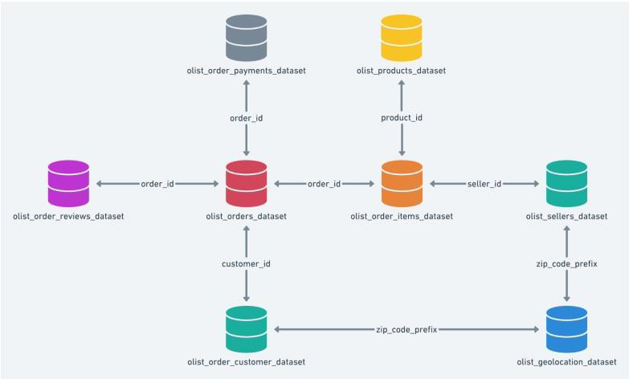

# brooklyndata_dbt
* Loads Brooklyndata olist dataset(https://app.mode.com/brooklyndata/tables) to Snowflake
* Creates data models using dbt


## prerequistes
* Have a [snowflake](https://signup.snowflake.com/?utm_source=google&utm_medium=paidsearch&utm_campaign=na-ca-en-brand-product-phrase&utm_content=go-eta-evg-ss-free-trial&utm_term=c-g-snowflake%20software-p&_bt=579189974810&_bk=snowflake%20software&_bm=p&_bn=g&_bg=136172940948&gclsrc=aw.ds&gad=1&gclid=Cj0KCQjwl8anBhCFARIsAKbbpyS5Y7XMEmrxORu7SObFo3SAqnAwaCdM7ov2ACIbl5wiPa44G3Mw4EsaAkA3EALw_wcB) account setup
* Install Snowsql: https://docs.snowflake.com/en/user-guide/snowsql-install-config
* Follow steps to configure snowsql: https://docs.snowflake.com/en/user-guide/snowsql-config
* Have Python3 installed

## set up
* To create and load raw data to DB:
  * replace(<ACCOUNT_NAME>, <LOGIN_NAME>) and run:
  ```bash
  snowsql -a <ACCOUNT_NAME> -u <LOGIN_NAME> -f create_load_data.sql
  ```
  * input password
* install dbt
   ```bash
   python3 -m venv venv
   source venv/bin/activate
   pip install -r requirements.txt
   ```
* update dbt snowflake credentials in `profile_credentials`

# run
```bash
cd gold
source ../profile_credentials

dbt test --store-failures
dbt docs generate
dbt docs serve
```